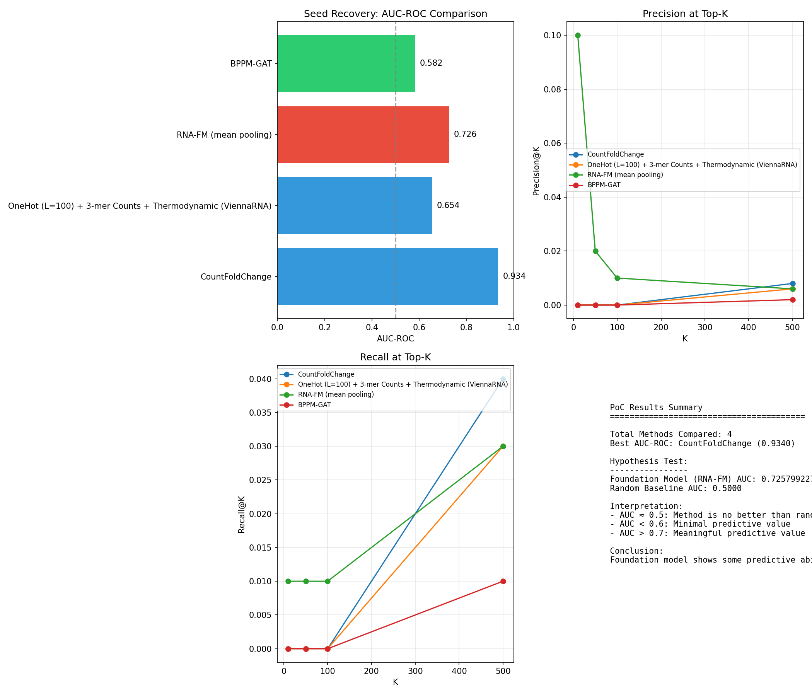

# SELEX Analyze PoC

Bioinformatics Term-Project (2025-Fall): Comparing RNA embedding methods for SELEX aptamer selection.

## Overview

This project evaluates whether foundation model embeddings can effectively identify enriched sequences in SELEX data. We compare:

- **Count-Based Baseline**: Fold-change between rounds
- **Physics-Based**: OneHot + k-mer + ViennaRNA thermodynamics
- **Foundation Model**: RNA-FM (mean pooling)
- **Graph Neural Network**: BPPM-GAT

## Results

| Method                | AUC-ROC |
| --------------------- | ------- |
| CountFoldChange       | 0.934   |
| RNA-FM (mean pooling) | 0.726   |
| Physics-Based         | 0.654   |
| BPPM-GAT              | 0.582   |

**Conclusion**: Simple count-based methods outperform embedding-based approaches for seed recovery in this dataset.



## Installation

```bash
# Requires Python 3.12+
uv sync

# With GPU support (Linux only)
uv sync --extra gpu
```

## Usage

```bash
python -m selex_analyze_poc.compare_embeddings \
    --data-dir ./data/aptasuite/ \
    --seeds-file ./data/aptasuite/seeds.txt \
    --output-dir ./results/
```

### Options

| Flag           | Description                              |
| -------------- | ---------------------------------------- |
| `--n-clusters` | Number of K-Means clusters (default: 20) |
| `--device`     | cpu/cuda/auto                            |
| `--max-len`    | Max sequence length (default: 100)       |
| `--skip-rnafm` | Skip RNA-FM (slow without GPU)           |
| `--skip-gat`   | Skip BPPM-GAT                            |

## Infrastructure

### GPU Pod Provisioning (RunPod)

Uses Terraform + OpenTofu to provision GPU instances on RunPod.

```bash
cd terraform/runpod

# Initialize
tofu init

# Deploy
tofu apply

# Destroy
tofu destroy
```

**Configuration** (`terraform/runpod/main.tf`):

- GPU: RTX 3090 / RTX 4090 / A6000
- Image: `runpod/pytorch:1.0.2-cu1281-torch280-ubuntu2204`
- Storage: 50GB volume + 20GB container disk

Secrets are managed via SOPS (`terraform/secrets.yaml`).

## Project Structure

```
.
├── src/selex_analyze_poc/
│   ├── base.py              # Base classes
│   ├── extractors.py        # Feature extractors
│   ├── ranker.py            # Ranking methods
│   ├── evaluation.py        # Metrics & visualization
│   └── compare_embeddings.py # Main comparison script
├── terraform/
│   └── runpod/              # GPU infrastructure
├── results/
│   ├── comparison_table.csv
│   ├── poc_comparison_summary.png
│   └── umap_comparison.png
└── pyproject.toml
```

## Dependencies

- PyTorch + PyTorch Geometric
- Transformers + MultiMolecule (RNA-FM)
- ViennaRNA
- Polars, scikit-learn, UMAP

## License

MIT
